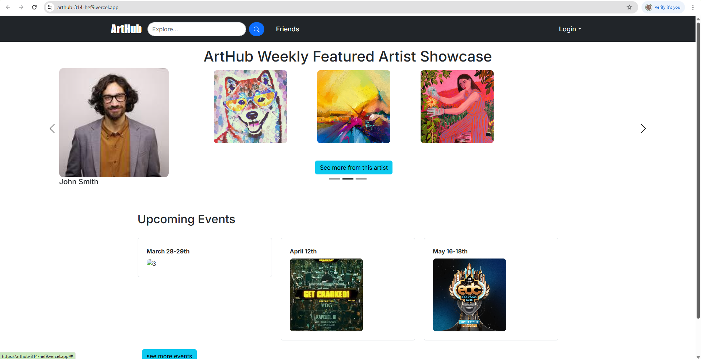
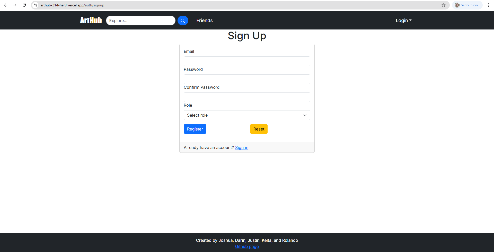
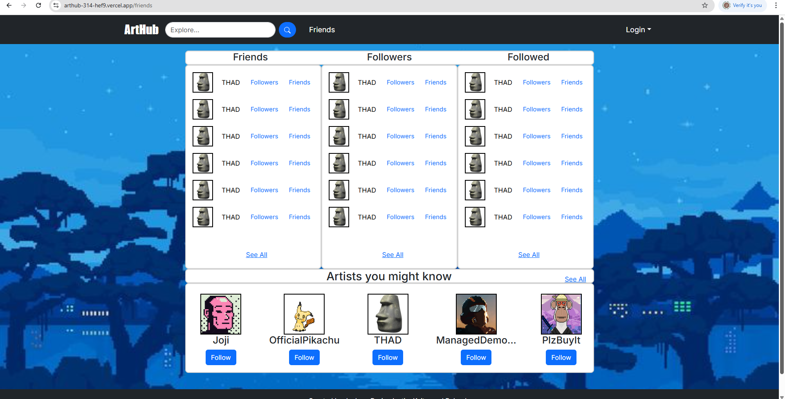
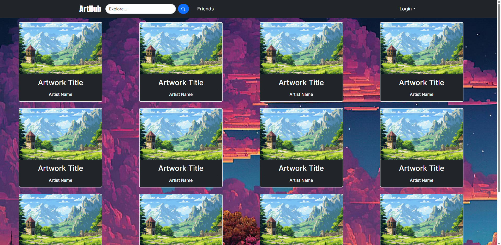
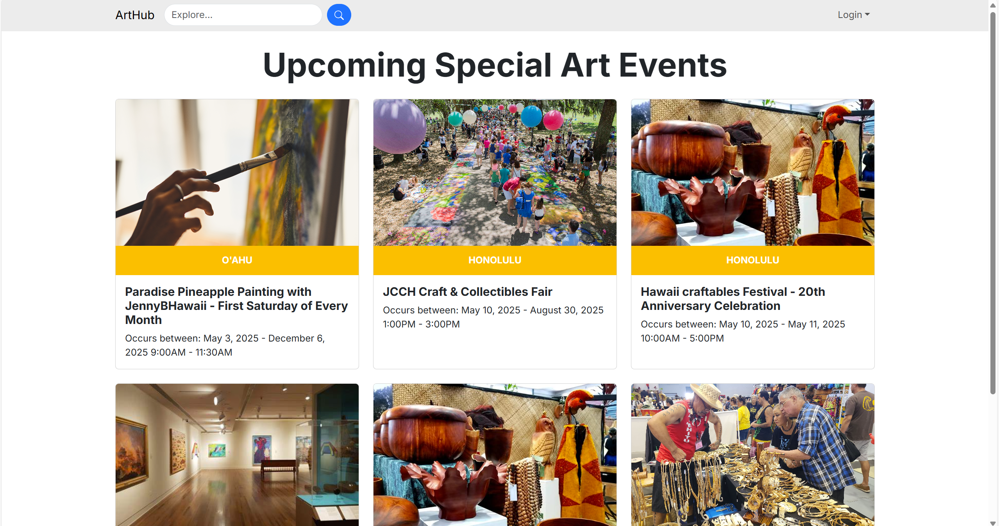

### Deployment

[ArtHub Application](https://arthub-314-cyan.vercel.app/)

---
### The Team
Joshua Cooperrider: [Github](https://github.com/joshuacooperrider)

Rolando Cadiz: [Github](https://github.com/rolando-cadiz)

Darin Wong: [Github](https://github.com/darinw7)

Keita Grant: [Github](https://github.com/KeitaGrant)

Justin Barrett: [Github](https://github.com/Justinrb998)

##### [View Team Contract](https://github.com/arthub-final-project/arthub.github.io/blob/main/Team%20Contract.pdf)

##### [M1](https://github.com/orgs/arthub-final-project/projects/3)

##### [M2](https://github.com/orgs/arthub-final-project/projects/4)

##### [M3](https://github.com/orgs/arthub-final-project/projects/6/views/1)

---

## Our Goal
Selling art and networking as a freelance artist is difficult. Using social media to showcase and advertise sounds like a great start, however, it is easy to get lost in the sea of profiles on social media sites. The majority of them are upstarts, people trying to become famous, or those looking to socialise. We want to create a platform that brings artists together, from amateurs to professionals, to...
- showcase their art and talents
- collaborate with fellow artists
- advertise current projects to the wider art community
- sell their products in an easy-to-use and secure marketplace

## Developer Guide
First, [install PostgreSQL](https://www.postgresql.org/download/). Then create a database for your application.

```

$ createdb nextjs-application-template
Password:
$

```

Second, go to [(https://github.com/arthub-final-project/arthub-314)], and click the "Use this template" button. Complete the dialog box to create a new repository that you own that is initialized with this template's files.

Third, go to your newly created repository, and click the "Clone or download" button to download your new GitHub repo to your local file system. Using [GitHub Desktop](https://desktop.github.com/) is a great choice if you use MacOS or Windows.

Fourth, cd into the directory of your local copy of the repo, and install third party libraries with:

```

$ npm install

```

Fifth, create a `.env` file from the `sample.env`. Set the `DATABASE_URL` variable to match your PostgreSQL database that you created in the first step. See the Prisma docs [Connect your database](https://www.prisma.io/docs/getting-started/setup-prisma/add-to-existing-project/relational-databases/connect-your-database-typescript-postgresql). Then run the Prisma migration `npx prisma migrate dev` to set up the PostgreSQL tables.

```

$ npx prisma migrate dev
Environment variables loaded from .env
Prisma schema loaded from prisma/schema.prisma
Datasource "db": PostgreSQL database "<your database name>", schema "public" at "localhost:5432"

Applying migration `20240708195109_init`

The following migration(s) have been applied:

migrations/
└─ 20240708195109_init/
└─ migration.sql

Your database is now in sync with your schema.

✔ Generated Prisma Client (v5.16.1) to ./node_modules/@prisma/client in 51ms

$

```

Then seed the database with the `/config/settings.development.json` data using `npx prisma db seed`.

```

$ npx prisma db seed
Environment variables loaded from .env
Running seed command `ts-node --compiler-options {"module":"CommonJS"} prisma/seed.ts` ...
Seeding the database

🌱 The seed command has been executed.
$

```

## Running the system

Once the libraries are installed and the database seeded, you can run the application by invoking the "dev" script:

```

$ npm run dev

> nextjs-application-template-1@0.1.0 dev
> next dev

▲ Next.js 14.2.4

- Local: http://localhost:3000
- Environments: .env

✓ Starting...
✓ Ready in 1619ms

```

### Viewing the running app

If all goes well, the template application will appear at [http://localhost:3000](http://localhost:3000). You can login using the credentials in [settings.development.json], or else register a new account.

### ESLint

You can verify that the code obeys our coding standards by running ESLint over the code in the src/ directory with:

```
$ npm run lint

> nextjs-application-template-1@0.1.0 lint
> next lint

✔ No ESLint warnings or errors
$
```

### Landing Page

The main page users will see upon entering the website



There is a rotating list of featured artists and an events section to view current and upcoming art events. The Search bar takes users to the Artworks page.

### Sign-Up Page

The page used for signing up for an account.
  


Roles allow for choosing between being an artist or an art collector.

### Friends and Followers Page

The page that lists a user's friends, the users that follow them, and the users they follow



### Artwork Gallery

The page that users use to view artworks independent of their creators, with a search function and category/tag system for finding desired artworks.




### Events Page 

This page shows upcoming events 



