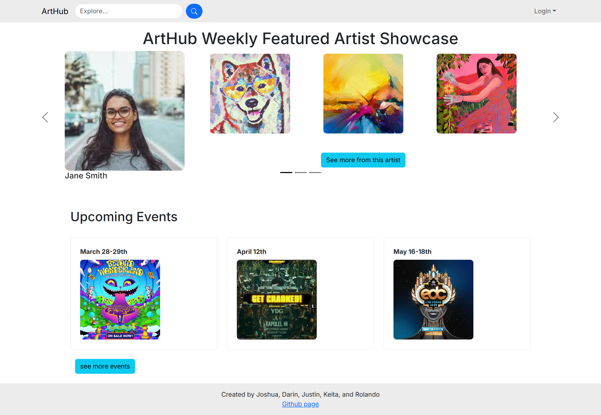
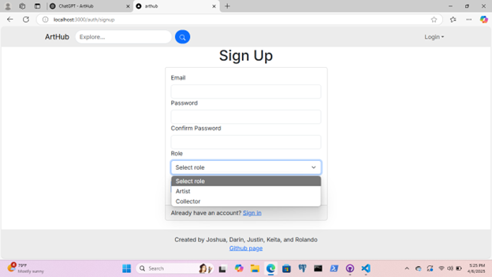
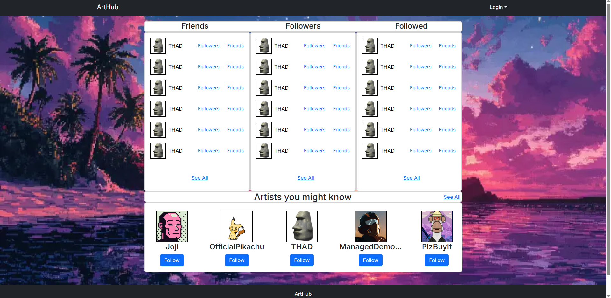
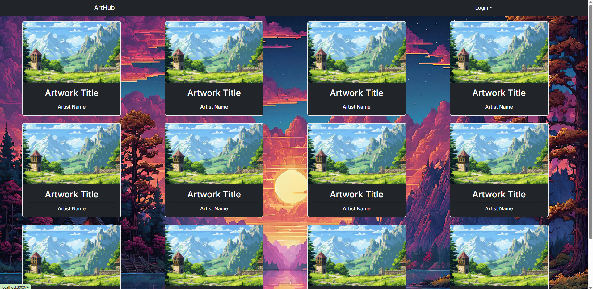

---
### The Team
Joshua Cooperrider: [Github](https://github.com/joshuacooperrider)

Rolando Cadiz: [Github](https://github.com/rolando-cadiz)

Darin Wong: [Github](https://github.com/darinw7)

Keita Grant: [Github](https://github.com/KeitaGrant)

Justin Barrett: [Github](https://github.com/Justinrb998)

##### [View Team Contract](https://github.com/arthub-final-project/arthub.github.io/blob/main/Team%20Contract.pdf)
---

## Our Goal
Selling art and networking as a freelance artist is difficult. Using social media to showcase and advertise sounds like a great start, however, it is easy to get lost in the sea of profiles on social media sites. The majority of them are upstarts, people trying to become famous, or those looking to socialise. We want to create a platform that brings artists together, from amateurs to professionals, to...
- showcase their art and talents
- collaborate with fellow artists
- advertise current projects to the wider art community
- sell their products in an easy-to-use and secure marketplace

## Mockup Pages

### Landing Page

The main page users will see upon entering the website

### Sign-Up Page

The page used for signing up for an account.
  

### Friends and Followers Page

The page that lists a user's friends, the users that follow them, and the users they follow

### Artwork Gallery

The page that users use to view artworks independent of their creators, with a search function and category/tag system for finding desired artworks.

