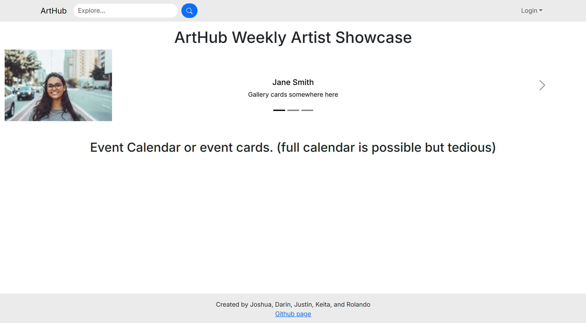
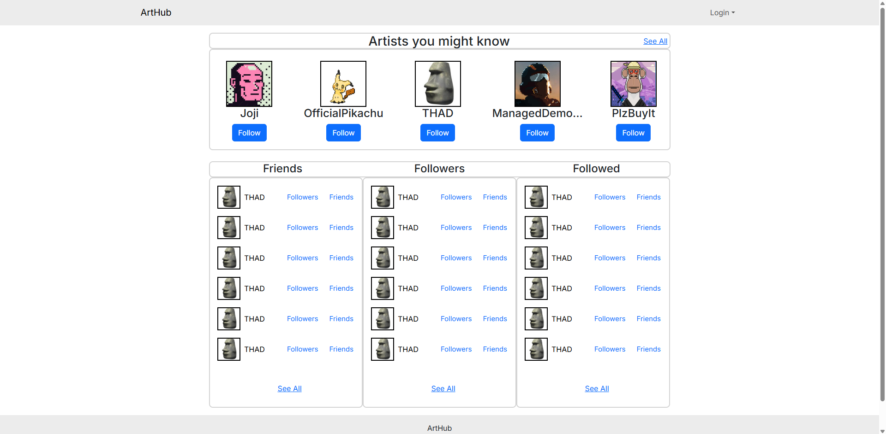

## Our Goal
Selling art and networking as a freelance artist is difficult. Using social media to showcase and advertise sounds like a great start, however, it is easy to get lost in the sea of profiles on social media sites. The majority of them are upstarts, people trying to become famous, or those looking to socialise. We want to create a platform that brings artists together, from amateurs to professionals, to...
- showcase their art and talents
- collaborate with fellow artists
- advertise current projects to the wider art community
- sell their products in an easy-to-use and secure marketplace

## Mockup Pages

### Landing Page

### Sign-Up Page
  

### Friends and Followers Page

