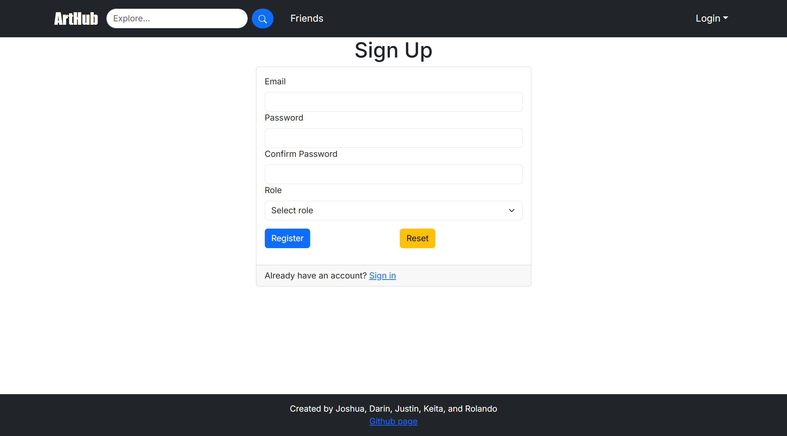
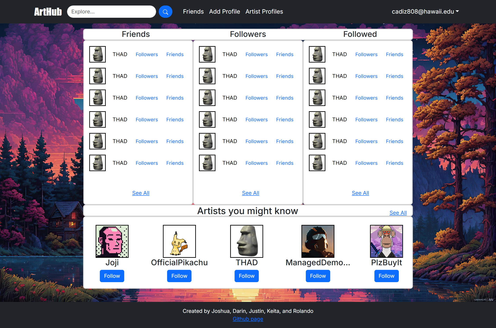
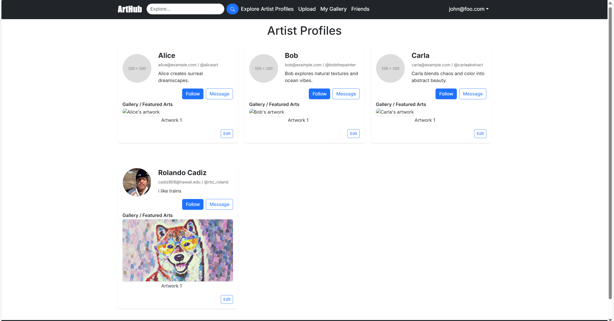
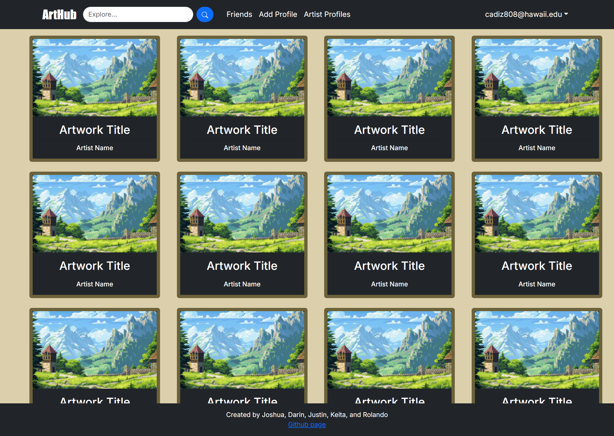
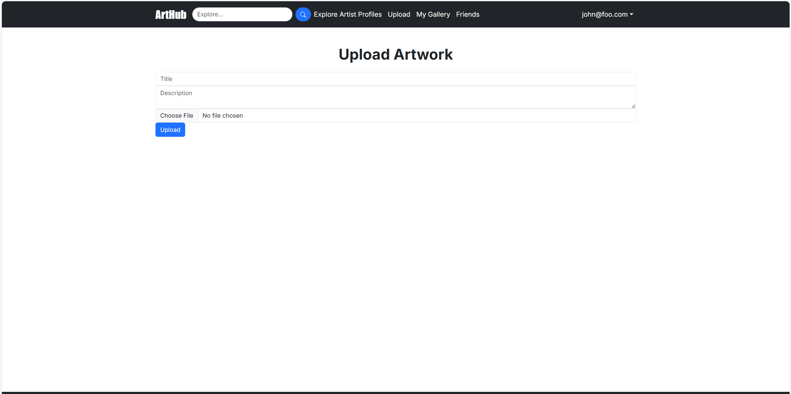

### Deployment

[ArtHub Application](https://arthub-314-cyan.vercel.app/)

---
### The Team
Joshua Cooperrider: [Github](https://github.com/joshuacooperrider)

Rolando Cadiz: [Github](https://github.com/rolando-cadiz)

Darin Wong: [Github](https://github.com/darinw7)

Keita Grant: [Github](https://github.com/KeitaGrant)

Justin Barrett: [Github](https://github.com/Justinrb998)

##### [View Team Contract](https://github.com/arthub-final-project/arthub.github.io/blob/main/Team%20Contract.pdf)

##### [M1](https://github.com/orgs/arthub-final-project/projects/3)

##### [M2](https://github.com/orgs/arthub-final-project/projects/4)

##### [M3](https://github.com/orgs/arthub-final-project/projects/6/views/1)

---

## Our Goal
Selling art and networking as a freelance artist is difficult. Using social media to showcase and advertise sounds like a great start, however, it is easy to get lost in the sea of profiles on social media sites. The majority of them are upstarts, people trying to become famous, or those looking to socialise. We want to create a platform that brings artists together, from amateurs to professionals, to...
- showcase their art and talents
- collaborate with fellow artists
- advertise current projects to the wider art community
- sell their products in an easy-to-use and secure marketplace

## Community Feedback
As we continued to work on the development of our ArtHub app, we also received valuable testing and feedback from many UH students on campus. The responses we got in return went in-depth about problems they encountered along the way, possible improvements that could be made, and certain aspects that stood out to them. The main issue that was common among all responses was that the AddProfile page was not working, and a new profile was not created after adding all the necessary information to do so. On the other hand, we also received good reviews about the designs of our pages, in particular the main and friends/followers pages.

The app is intended for use by students and those within Manoa with the general purpose of showcasing their art, and collaborating with others to sell them to the art community. Given that UH also offers art courses, it is a good opportunity for those who want to display their accomplishments to a greater portion of the university community, and make new friends at the same time while creating or browsing art!

The main page is especially useful because it allows users to see a showcase of work from a selected artist every week, as well as a list of upcoming events that may be interesting to them. Also, the Explore Artists Profile page makes it simple to view a person's profile, which includes the artwork of their choice, quick description of themselves, and contact information for communication purposes. The Upload and My Gallery features also work hand in hand together, as one can simply upload their artwork pieces and be the only one who can see them.

## Developer Guide
First, [install PostgreSQL](https://www.postgresql.org/download/). Then create a database for your application.

```

$ createdb nextjs-application-template
Password:
$

```

Second, go to [(https://github.com/arthub-final-project/arthub-314)], and click the "Use this template" button. Complete the dialog box to create a new repository that you own that is initialized with this template's files.

Third, go to your newly created repository, and click the "Clone or download" button to download your new GitHub repo to your local file system. Using [GitHub Desktop](https://desktop.github.com/) is a great choice if you use MacOS or Windows.

Fourth, cd into the directory of your local copy of the repo, and install third party libraries with:

```

$ npm install

```

Fifth, create a `.env` file from the `sample.env`. Set the `DATABASE_URL` variable to match your PostgreSQL database that you created in the first step. See the Prisma docs [Connect your database](https://www.prisma.io/docs/getting-started/setup-prisma/add-to-existing-project/relational-databases/connect-your-database-typescript-postgresql). Then run the Prisma migration `npx prisma migrate dev` to set up the PostgreSQL tables.

```

$ npx prisma migrate dev
Environment variables loaded from .env
Prisma schema loaded from prisma/schema.prisma
Datasource "db": PostgreSQL database "<your database name>", schema "public" at "localhost:5432"

Applying migration `20240708195109_init`

The following migration(s) have been applied:

migrations/
└─ 20240708195109_init/
└─ migration.sql

Your database is now in sync with your schema.

✔ Generated Prisma Client (v5.16.1) to ./node_modules/@prisma/client in 51ms

$

```

Then seed the database with the `/config/settings.development.json` data using `npx prisma db seed`.

```

$ npx prisma db seed
Environment variables loaded from .env
Running seed command `ts-node --compiler-options {"module":"CommonJS"} prisma/seed.ts` ...
Seeding the database

🌱 The seed command has been executed.
$

```

## Running the system

Once the libraries are installed and the database seeded, you can run the application by invoking the "dev" script:

```

$ npm run dev

> nextjs-application-template-1@0.1.0 dev
> next dev

▲ Next.js 14.2.4

- Local: http://localhost:3000
- Environments: .env

✓ Starting...
✓ Ready in 1619ms

```

### Viewing the running app

If all goes well, the template application will appear at [http://localhost:3000](http://localhost:3000). You can login using the credentials in [settings.development.json], or else register a new account.

### ESLint

You can verify that the code obeys our coding standards by running ESLint over the code in the src/ directory with:

```
$ npm run lint

> nextjs-application-template-1@0.1.0 lint
> next lint

✔ No ESLint warnings or errors
$
```


### User Guide For ArtHub Website:

### 1. Landing Page

The main page users will see upon entering the website


There is a rotating list of featured artists and an events section to view current and upcoming art events. The Search bar takes users to the Artworks page.

### 2. Events Page 

This page shows upcoming art events.


### 3. Sign-Up Page

This page used for signing up for an account.
  


### 4. Friends and Followers Page

Once signed in, users will be able to view the rest of the pages. Such as this this page that lists a user's friends, the users that follow them, and the users they follow.



### 5. Explore Artist Profiles Page



This page will show various artist profiles as well as their uploaded artwork

### 6. Artwork Gallery

The page that users use to view artworks independent of their creators, with a search function and category/tag system for finding desired artworks.



### 7. Upload ArtWork

This page will allow users to upload their artwork 




